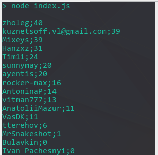
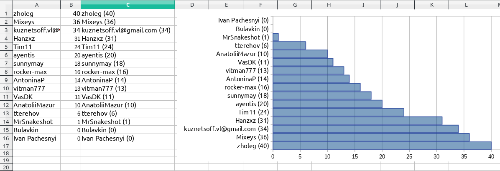

# Simple stats script for codewars.com

Collects number of catas completed by some users at codewars.com, starting since some date.

## Usage
- npm install
- npm start

## Some screenshots

### Sample output

### Spreadsheet
